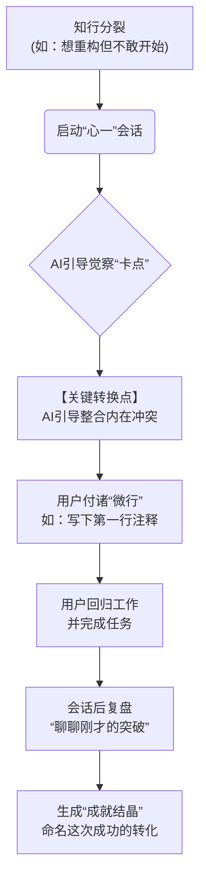

# “心一”MVP 核心战略与目标 (知行合一版)

> **版本**: 1.0
> **日期**: 2025-07-03
> **状态**: 生效
> **摘要**: 本文档是“心一”产品MVP阶段的最高纲领。它定义了MVP的指导原则、核心目标、范围边界与成功标准，旨在以最小成本，验证我们核心产品体验的有效性。

---

## 1. MVP 核心指导原则 (Core MVP Principles)

我们当前的首要任务**不是**构建一个功能完备、体验完美的“个人成长平台”，而是聚焦于**打造一个能为使用智能手机成瘾的挂科差生解决“知行不一”问题的“实践道场”**。

为此，我们确立以下三大核心原则：

1.  **验证优于构建 (Validation over Building)**: MVP的唯一目的，是通过最少的投入，获取关于核心体验有效性的真实认知。我们为学习而构建，而非为发布而构建。
2.  **深度优于广度 (Depth over Breadth)**: 我们将放弃庞大的功能体系，聚焦于打磨一个“最小但完整”的“觉察卡点 -> 整合冲突 -> 付诸微行 -> 复盘固化”核心体验闭环。用极致的单点体验，验证产品的核心价值。
3.  **专注“器”，内化“道” (Focus on the "Vessel", Internalize the "Way")**: MVP阶段的所有工作，都必须遵循“隐去神话，只留魔法”的设计哲学。我们100%聚焦于打磨产品的直接体验与效果，而非解释其背后的深刻理念。

---

## 2. MVP 战略目标 (Strategic Goals of MVP)

### 2.1. 首要目标 (Primary Goal)

**在最小成本下，验证我们的核心产品体验（安全的“清障”对话、高效的“启动”引擎、正向的“心能”循环），对于帮助使用智能手机成瘾的挂科差生解决“知道但做不到”的实际问题是否有效。**

具体而言，我们需要回答：

> **我们能否通过一个高效的“内在整合”对话，有效帮助开发者将“应该做但不想做”的内心冲突，转化为足以解决问题的“第一步行动”，并让开发者认可这种工具的价值？**

### 2.2. 核心待验证假设 (Core Hypotheses to Validate)

*   **假设1 (钩子假设)**: “知道做不到？心一，陪你迈出第一步”这一核心卖点，能有效吸引因内心冲突而导致行动停滞的使用智能手机成瘾的挂科差生的注意力。
*   **假设2 (觉察假设)**: 用户愿意遵循AI的引导，通过对话，识别并承认阻碍自己行动的真正“卡点”（如：恐惧、完美主义、认知不清）。
*   **假设3 (转化假设)**: 在觉察卡点后，用户愿意接受AI的“整合”与“赋能”指令，并认为这对于自己迈出第一步是有帮助的。
*   **假设4 (价值假设)**: 成功通过本工具完成一次“知行转化”后，用户能感受到其价值，并愿意在下一次陷入“知行不一”的困境时再次使用它。

---

## 3. 目标用户 (Target Audience for MVP)

为确保早期用户反馈的有效性，我们将100%聚焦于我们的“滩头阵地”用户。

| 用户画像 | 特征描述 | 核心痛点 |
| :--- | :--- | :--- |
| **使用智能手机成瘾的挂科差生** | 1. 在日常学习中，频繁因为作业、复习、备考等问题，陷入“知道应该学习，但就是不想开始”的困境。 2. 对能够解决根本心理障碍、而不仅仅是提升表面效率的工具有浓厚兴趣。 3. 手机使用时间长，自控力差，沉迷于短视频和游戏。 | 1. **行动瘫痪**: 一个重要的学习任务，因为内心的冲突而被无限期拖延。 2. **精神内耗**: “理智”与“情绪”的反复拉扯，消耗大量心理能量，即使没学习也感觉很累。 3. **自信腐蚀**: 反复的“挂科”会侵蚀自我效能感，导致自我怀疑。 |

---

## 4. MVP 范围定义 (Scope Definition)

遵循“深度优于广度”的原则，我们对MVP的功能范围进行严格的“断舍离”。

### 4.1. 核心体验闭环：从“知行分裂”到“知行合一”

### 4.2. 功能范围 (In-Scope Features)

| 模块 | 功能点 | 备注 |
| :--- | :--- | :--- |
| **核心对话** | 遵循“知行转化SOP”的AI对话流 | 严格执行“觉察卡点 -> 整合冲突 -> 付诸微行 -> 复盘固化”四阶段协议。 |
| **状态触发器** | 手动触发 | 用户在感到“知行不一”时，可以随时手动开启会话。 |
| **微行启动器** | 专注计时器 / 任务分解清单 | 当“整合”完成后，为用户提供一个具体的、能立即开始行动的工具。 |
| **成就结晶** | 突破复盘与命名 | 生成包含“卡点描述”、“关键洞察”、“完成的微行动”的、更有价值的结晶。 |

### 4.3. 明确排除的功能 (Out-of-Scope Features)

*   **所有与“世界观揭示”相关的功能**: 不包含任何关于“碳基/硅基”、“内在自我”的引导和解释。
*   **复杂用户系统**: 早期版本可匿名使用，或使用GitHub等开发者身份一键登录。
*   **除核心闭环外所有功能**: 无社群、无复杂游戏化、无成长报告等。

---

## 5. 成功衡量指标 (MVP Success Metrics)

MVP阶段的成功，以**学习成果**和**工具价值验证**为衡量标准。

| 指标类别 | 核心指标 | 目标/衡量方式 |
| :--- | :--- | :--- |
| **学习与验证 (首要)** | **“知行转化率”** | **核心北极星指标**。衡量从“启动会话”到“成功付诸微行”的用户比例。 |
| | **定性反馈 (Qualitative Feedback)** | 完成对至少20位使用智能手机成瘾的挂科差生的深度访谈，验证“内在整合-知行转化”模型是否真的帮助他们解决了“做不到”的问题。 |
| **工具价值 (次要)** | **问题启动率 (Problem Initiation Rate)** | 通过访谈和问卷，衡量有多少比例的用户认为“心一”对他们最终“开始”那个拖延的任务起到了帮助。 |
| | **重复使用意愿 (Repeat Usage Intention)** | 在用户成功完成一次转化后，通过问卷询问其“下次遇到类似问题时，再次使用本工具的意愿”，评分 > 4.0/5.0。 |
| | **7日留存率 (D7 Retention)** | 使用智能手机成瘾的挂科差生的7日留存率 > 10%。判断工具是否有基本的粘性。 |

---

## 6. MVP 阶段市场策略 (Go-to-Market Strategy for MVP)

| 策略 | 具体行动 |
| :--- | :--- |
| **用户获取** | **精准渠道**: 在校园论坛、学习社区、教育平台等学生聚集的社区，进行精准投放和内容营销。 |
| **核心叙事策略** | **统一钩子**: 所有对外沟通，统一使用“**知道做不到？心一，陪你迈出第一步。**”作为核心卖点。 **价值支撑**: 用“帮你整合内心冲突，将纠结转化为代码”作为核心价值解释。 |
| **沟通原则** | **“功夫”原则**: 所有文案都必须是实践性的、结果导向的。我们是一个帮助开发者在“事上练”的“道场”，而不是一个理论说教者。 |
| **品牌叙事原则** | **“隐去神话，只留魔法”**: 在MVP阶段，所有对外的品牌和市场沟通，都必须 **100%聚焦于“心一 (OneMind)”作为工具的直接价值**。我们提供的是魔法，而不是魔法的教程。在取得明确的市场验证前，主动弱化甚至不提及更宏大的哲学愿景。 |

---

## 7. MVP 阶段商业模式 (Business Model for MVP)

**完全免费。**

MVP阶段的唯一目标是验证核心工具价值，任何形式的收费都会对这个目标造成干扰。