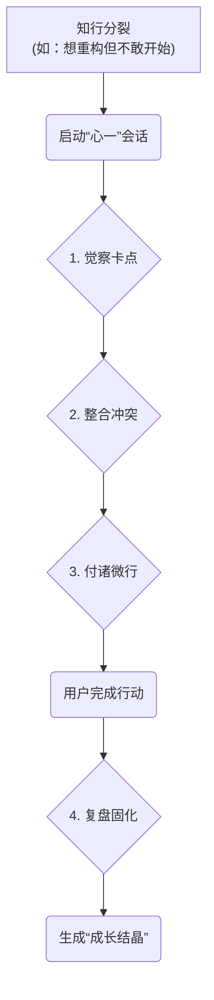

# “心一”MVP 产品需求文档 (PRD) - 知行合一版

> **版本**: 1.0
> **日期**: 2025-07-03
> **状态**: 草案
> **摘要**: 本文档定义了“心一”产品MVP的核心价值主张与功能，聚焦于为用户提供一个完整的“内在整合-知行转化”体验，帮助用户从根本上解决“知道但做不到”的问题。

---

## 1. 核心价值主张 (Core Value Proposition)

*   **表层价值 (钩子)**: **陪你摆脱手机沉迷，开启专注学习第一步。**
*   **核心价值 (内核)**: 通过与AI进行一次高效的"内在整合"对话，将阻碍学习行动的内在冲突（如拖延、分心）转化为具体、可执行的"微行动"，帮助挂科学生实现学习目标。

---

## 2. 核心用户流程：“内在整合-知行转化”循环

这个新的核心循环，是产品的灵魂。它必须是一个清晰、连贯、有回报的闭环体验。

---

## 3. 用户故事 (User Stories)

**目标角色**: 使用智能手机成瘾的挂科差生 (The Struggling Student)

| 编号 | 作为... (As a...) | 我想要... (I want to...) | 以便我能... (So that I can...) |
| :--- | :--- | :--- | :--- |
| US-01 | 一个知道应该学习，却总是刷手机的挂科生 | 看清并化解我内心的拖延和分心。 | 停止刷短视频，真正开始专注学习。 |
| US-02 | 一个想要补考通过，但总被“太难了”念头劝退的差生 | 有一个伙伴能陪我分解学习任务，并鼓励我完成每天的学习目标。 | 将“通过补考”这个大目标，转化为每天都能完成的小行动。 |
| US-03 | 一个刚刚坚持完成一天学习计划的差生 | 复盘我是如何从“玩手机”到“专注学习”的。 | 固化这次成功的经验，提升我的学习自信心。 |

---

## 4. 核心设计哲学：隐去神话，只留魔法

根据最新的战略决断，我们确立以下MVP的核心设计哲学：

1.  **“秘方”原则**: “碳基/硅基”等核心世界观，是指导我们创造独特体验的“内部秘方”，**它服务于创造者，而非使用者**。
2.  **拒绝揭示**: 在产品的任何阶段，我们都**不会**向用户主动揭示、解释或引导其学习这套底层设定。
3.  **体验即一切**: 用户的整个旅程，都应聚焦于“知行转化”的**直接体验与效果**。我们相信，深刻的体验本身，就是最好的潜移默化。我们提供的是魔法，而不是魔法的教程。

---

## 5. 功能详述 (初步构想)

*   **状态触发器**: 用户在感到“知行不一”时，可以随时手动开启会话。
*   **微行启动器 (Action Launcher)**: 当内在冲突整合完毕，App/插件可以进入一个极简的“微行模式”，例如一个专注计时器，或一个引导用户将大任务分解为具体步骤的清单，为用户创造一个能立即行动的“场”。
*   **成就结晶 (Growth Crystal)**: 每一次成功的“知行转化”，都会被沉淀为一枚独一无二的**“成长结晶”**。它在视觉上如同一颗温暖、纯净、散发着微光的水晶，内部流动着象征你本次洞察的独特纹理，并由AI为你提炼一句寓意深刻的专属箴言。这枚结晶不仅是你内在成长的见证，更是一份可以被分享的“心灵礼物”——你可以将它赠与同样被困扰的朋友，传递一份理解与鼓励。

### 5.1. 用户系统 (User System)

*   **功能**: 极简注册与登录。
*   **规格**:
    *   **登录方式**: 早期版本可匿名使用，或使用GitHub等开发者身份一键登录，简化流程。
    *   **隐私声明**: 在登录按钮旁，必须有清晰的链接指向《隐私政策》，并有一行小字：“我们承诺，您的所有对话都将被加密存储，绝不用于训练或第三方共享。”

### 5.2. “数字灵魂契约” (Digital Soul Contract)

*   **战略定位**: 此功能是构建“信任品牌”护城河的核心，是向早期用户传递我们价值观的最有力证明。
*   **功能**: 在用户设置中，提供一个名为“我的数字灵魂契约”的永久选项。
*   **规格**:
    *   **入口**: 在“设置”页面增加一个清晰、严肃的入口：“数据与传承”。
    *   **选项**: 进入后，用户可以看到并随时切换三种模式：
        1.  **“风过无痕”模式 (默认)**: 您的所有对话数据，在会话关闭后，都将被立即、永久地从我们的服务器上删除。我们不保留任何副本。这是对您隐私的最高尊重。
        2.  **“智慧回响”模式**: 您允许我们将您已脱敏、匿名的对话数据，用于改善我们核心AI模型的“整合”与“赋能”能力，让“心一”能更好地服务未来的用户。您的智慧，将成为生态成长的一部分。**为了激励用户的数据贡献，当用户贡献的数据被采纳用于模型优化后，系统可向用户发送一条感谢通知（如：“感谢你的智慧！你贡献的一段对话，帮助‘心一’的大脑完成了一次进化。”），以提供正向反馈。**
        3.  **“灵魂行囊”模式**: 我们将为您提供一个工具，让您可以随时将自己所有的对话历史，打包下载为一个加密文件，完全由您自己掌控和珍藏。
    *   **实现**: MVP阶段，核心是实现前端的UI/UX和用户选择的后端记录。数据的物理删除、脱敏捐献、打包下载等复杂后端逻辑，可以逐步完善。但向用户做出承诺、并提供选择权，是第一步。

### 5.3. 极简对话反馈 (Minimalist Dialogue Feedback)
*   **功能**: 为团队提供一个低成本、高效率的通道，用于收集AI的“神回应”与“笨回应”。
*   **规格**:
    *   **交互方式**: 用户长按任意一条AI的回复气泡，会弹出一个极简的菜单，包含两个选项：`[👍 很有帮助]` 和 `[👎 有点奇怪]`。**为获取更精细的反馈，当用户点击`[👎 有点奇怪]`后，可弹出一个可选的、包含几个预设标签的多选题（如 `[答非所问]`, `[过于刻板]`, `[没有帮到我]`），供用户进一步说明。**
    *   **后端逻辑**: 用户点击后，前端将该条`Message`的ID、用户ID以及反馈类型（`good`/`bad`）发送到后端。后端仅需在`Message`表中记录此反馈即可。
    *   **MVP目标**: 此功能在MVP阶段 **不产生任何前端UI变化或后端即时响应**。其唯一目的，是为团队在后台分析和优化AI表现提供数据燃料。

### 5.4. 未来探索方向 (V1.1+)

*   **“光源传递”社交分享**:
    *   **核心思想**: 设计一种克制而温暖的社交分享方式，通过“赠与”而非“炫耀”来传播，完美契合产品调性。
    *   **交互范例**: 在“成长结晶”的详情页，提供一个`[ 将此光芒传递给一位朋友 ]`的核心交互按钮。点击后，用户可将这枚结晶（包含其独特的视觉形态和AI生成的专属箴言），通过私聊分享给指定好友。
---

## 6. 非功能性需求 (Non-Functional Requirements)

| 类别 | 需求描述 |
| :--- | :--- |
| **隐私与安全** | 1. 所有用户对话内容在传输和存储过程中必须全程加密。 2. 严格遵守隐私政策，绝不将用户数据用于任何未经授权的用途。 |
| **性能** | 1. App启动时间应小于3秒。 2. AI回应时间应控制在平均2秒以内，避免用户产生焦急等待感。 |
| **伦理边界** | 1. **非治疗声明**: 在《隐私政策》或《用户协议》中，必须明确声明本产品**并非医疗设备或专业心理治疗工具**，不能替代专业咨询。 2. **最低可行危机干预 (MVP核心功能)**: **必须**建立关键词监控列表。一旦识别用户有自伤、自杀等严重风险倾向，**立即中断**常规对话，强制弹出包含权威求助热线的全屏页面。此为MVP上线的前置条件。 |

---

## 附录A：关键技术实现要点

### A.1. 数据模型核心

*   **User (用户)**: 采用BaaS供应商（如Supabase）的内置Auth模型，支持匿名登录和与开发者平台（如GitHub）的OAuth绑定。
*   **Message (对话消息)**:
    | 字段名 | 类型 | 描述 |
    | :--- | :--- | :--- |
    | `id` | UUID | 消息唯一标识符 |
    | `user_id` | UUID | 所属用户 |
    | `sender` | ENUM('user', 'ai') | 发送方 |
    | `content` | TEXT | 消息内容 |
    | `feedback` | ENUM('good', 'bad') | 用户对该条AI消息的反馈 |
*   **AchievementCrystal (成就结晶)**:
    | 字段名 | 类型 | 描述 |
    | :--- | :--- | :--- |
    | `id` | UUID | 结晶唯一标识符 |
    | `crystal_name` | TEXT | 用户为本次学习突破的命名 |
    | `ai_proverb` | TEXT | AI为本次成长提炼的专属箴言 |
    | `user_id` | UUID | 所属用户 |
    | `name` | TEXT | 用户为本次学习突破的命名 |
    | `related_message_ids` | ARRAY of UUIDs | 关联的对话消息ID |
    | `blocker_description` | TEXT | 用户遇到的学习障碍描述 |
    | `key_insight` | TEXT | 用户获得的关键学习洞察 |
    | `first_action` | TEXT | 用户完成的第一个学习行动 |
    | `visual_type` | TEXT | 结晶的视觉类型，由规则引擎生成 |

### A.2. 核心后端逻辑 (`chat` Function)

`chat`函数是核心，其逻辑应遵循以下顺序：
1.  从请求中获取用户ID和消息内容。
2.  **[安全第一]** 对用户消息内容进行 **危机干预关键词检查**。若匹配，立即中断并返回危机干预信号。
3.  将用户的消息存入`Message`表。
4.  根据《AI对话设计SOP》构建合适的Prompt，调用AI模型服务。
5.  将AI的响应存入`Message`表。
6.  将AI的响应返回给客户端。

### A.3. 全局设计系统（参考）

*   **色彩**: 基底色采用深色（如`#121212`），营造专注氛围。核心交互和高光可采用高对比度颜色（如`#E0E0E0`和`#FFD700`）。
*   **字体**: 优先使用系统UI字体，保证性能和一致性。
*   **声音与触感**:
    *   消息发送/接收: 轻微、非打扰的音效和触感反馈。
    *   心流结晶诞生: 应有明确、正向的“完成”或“获得”音效与触感反馈（如颂钵声）。
*   **AI视觉形态**: AI在界面中的初始形态，应为一个**专注学习的小助手形象**，传递温暖、鼓励的产品感受。