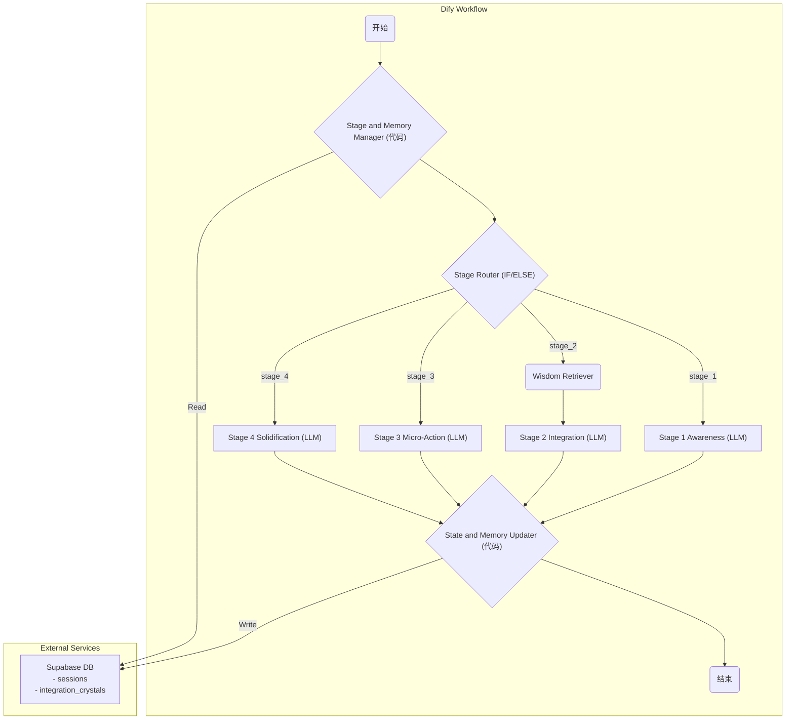

# “心一” Dify 工作流开发文档

> **版本**: 1.0
> **日期**: 2025-07-08
> **状态**: 草案
> **关联文档**: `7_AI_System_Prompt.md`, `6_RAG知识库构建与迭代SOP.md`, `4_AI对话设计SOP.md`
> **摘要**: 本文档旨在将项目的核心AI逻辑，转化为在Dify平台上可执行、可部署的具体工作流。它为开发者提供了从知识库配置到每个节点参数设置的详细作业指导。

---

## 1. 核心理念：可视化编排“内在整合”之旅

我们将通过Dify的可视化编排能力，将《AI对话设计SOP》中定义的“内在整合-知行转化”四阶段协议，构建为一个由状态机驱动、RAG增强的智能工作流。

**核心实现思路**:

1.  **状态机**: 使用Dify的 **变量** 和 **代码节点** 与外部数据库（Supabase）交互，来模拟和持久化用户的对话阶段 (`current_stage`)。
2.  **RAG**: 使用Dify的 **知识库** 和 **知识检索节点**，为AI在关键阶段注入来自心理学和实践智慧的“弹药”。
3.  **长期记忆 (MemoBase)**: 使用 **代码节点** 与外部数据库（Supabase）交互，实现对用户“成长结晶 (Integration Crystal)”的长期记录与读取，达成“修身”效果。

---

## 2. Dify 工作流概览图



---

## 3. 知识库配置

1.  **名称**: `OneMind Wisdom Knowledge Base`
2.  **描述**: 一个旨在帮助用户整合内在冲突、实现“知行合一”的智慧库。包含处理拖延、完美主义、恐惧等“心障”的心理学模型、提问范例和思维框架。
3.  **数据集**:
    *   严格遵循 [`6_RAG知识库构建与迭代SOP.md`](./6_RAG知识库构建与迭代SOP.md) 中定义的JSON格式，批量导入知识。
    *   **分块与清洗策略**: 使用“以JSON为单位”的分块策略，确保每个知识块的完整性。
4.  **检索设置**:
    *   **检索模式**: **Rerank**。这对于需要高精度语义匹配的心理学知识场景至关重要。
    *   **Top K**: 3。召回3个最相关的知识块，供Rerank模型精选。

---

## 4. 状态机与记忆 (MemoBase) 实现

这是将Dify从无状态工具变为有状态教练的关键。

### 4.1. Supabase 数据表设计

我们需要在Supabase中创建两个核心表：

1.  **`sessions` (会话状态表)**
    | 字段名 | 类型 | 描述 |
    | :--- | :--- | :--- |
    | `session_id` | TEXT | 会话唯一标识符 (主键) |
    | `user_id` | TEXT | 用户唯一标识符 |
    | `current_stage` | TEXT | 当前对话阶段，如 `stage_1_awareness` |
    | `updated_at` | TIMESTAMPZ | 最后更新时间 |

2.  **`integration_crystals` (成长结晶/长期记忆表)**
    *   此表结构完全遵循 [`1_MVP_产品需求文档.md`](./1_MVP_产品需求文档.md) 中定义的 `IntegrationCrystal` 数据模型。

### 4.2. Dify 变量

*   在Dify工作流的「变量」面板中，定义全局变量，用于在节点间传递数据。

---

## 5. 节点详细配置

### **节点1: `开始`**

*   **用户输入表单**:
    *   `user_input`: 用户本次的输入内容。
    *   `user_id`: 用户的唯一标识符。
    *   `session_id`: 客户端生成的会话ID。
    *   `current_stage`: 从客户端传递的当前阶段（如果客户端有缓存），否则为空。

### **节点2: `Stage & Memory Manager` (代码节点)**

*   **输入变量**: `user_id`, `session_id`, `current_stage`
*   **代码 (Python)**:
    ```python
    import supabase

    # 从环境变量中获取Supabase连接信息
    # ... supabase_client setup ...

    def main(args: dict) -> dict:
        session_id = args.get("session_id")
        user_id = args.get("user_id")
        current_stage = args.get("current_stage")

        # 1. 获取或初始化会话状态
        session_data = supabase_client.table("sessions").select("*").eq("session_id", session_id).execute()
        if not session_data.data:
            current_stage = "stage_1_awareness"
            supabase_client.table("sessions").insert({"session_id": session_id, "user_id": user_id, "current_stage": current_stage}).execute()
        else:
            current_stage = session_data.data[0]['current_stage']

        # 2. 读取长期记忆 (MemoBase)
        crystal_data = supabase_client.table("integration_crystals").select("name, key_insight").eq("user_id", user_id).order("created_at", desc=True).limit(1).execute()
        long_term_memory_insight = ""
        if crystal_data.data:
            long_term_memory_insight = f"根据你上次的成长结晶《{crystal_data.data[0]['name']}》，你似乎在学习如何与'{crystal_data.data[0]['key_insight']}'共处。"

        return {
            "stage": current_stage,
            "memory_insight": long_term_memory_insight
        }
    ```
*   **输出变量**: `stage`, `memory_insight`

### **节点3: `Stage Router` (IF/ELSE 节点)**

*   **IF**: `{{Stage_and_Memory_Manager.stage}}` 等于 `stage_1_awareness`
*   **ELSE IF**: `{{Stage_and_Memory_Manager.stage}}` 等于 `stage_2_integration`
*   ... (为每个阶段创建一个分支)

### **节点4: `Wisdom Retriever` (知识检索节点)**

*   **放置位置**: 仅放置在 `stage_2_integration` 分支下。
*   **知识库**: 选择 `OneMind Wisdom Knowledge Base`。
*   **查询内容**: `{{user_input}}`
*   **模式**: Rerank
*   **输出变量**: `retrieved_knowledge`

### **节点5: `Stage_X_LLM` (LLM 节点)**

为每个阶段（1, 2, 3, 4）分别创建一个LLM节点。

*   **通用配置**:
    *   **System Prompt**: 复制粘贴 [`7_AI_System_Prompt.md`](./7_AI_System_Prompt.md) 的全部内容。
*   **Prompt (以 Stage 2 为例)**:
    ```jinja
    # CONTEXT
    用户长期记忆洞察: {{Stage_and_Memory_Manager.memory_insight}}
    从智慧库中检索到的相关知识:
    
    - {{item.content}}
    

    # TASK
    你当前处于 **stage_2_integration** 阶段。
    请严格遵循System Prompt中为该阶段定义的角色、目标和行动步骤，与用户进行对话。
    这是用户的输入: {{user_input}}
    ```
*   **输出变量**: `ai_response`

### **节点6: `State & Memory Updater` (代码节点)**

*   **输入变量**: `user_id`, `session_id`, `stage`, `ai_response`
*   **代码 (Python)**:
    ```python
    # ... supabase_client setup ...

    def get_next_stage(current_stage):
        stages = ["stage_1_awareness", "stage_2_integration", "stage_3_micro_action", "stage_4_solidification"]
        try:
            idx = stages.index(current_stage)
            return stages[idx + 1] if idx + 1 < len(stages) else "completed"
        except ValueError:
            return "stage_1_awareness"

    def main(args: dict) -> dict:
        session_id = args.get("session_id")
        current_stage = args.get("stage")
        ai_response = args.get("ai_response")

        # 简单的逻辑：假设每次调用都推进一个阶段
        # 生产环境需要更复杂的逻辑，如通过LLM判断阶段是否完成
        next_stage = get_next_stage(current_stage)

        if next_stage == "completed":
            # 在这里可以调用另一个LLM来从对话历史中提炼成长结晶
            # ...
            # supabase_client.table("integration_crystals").insert({...}).execute()
            supabase_client.table("sessions").delete().eq("session_id", session_id).execute()
        else:
            supabase_client.table("sessions").update({"current_stage": next_stage}).eq("session_id", session_id).execute()

        return {
            "final_response": ai_response
        }
    ```
*   **输出变量**: `final_response`

### **节点7: `结束`**

*   **输出**: `{{State_and_Memory_Updater.final_response}}`

---

## 6. 危机干预实现

1.  **Dify内置敏感词**: 在「设置」-「内容审查」中，配置危机干预关键词。这可以作为第一道防线。
2.  **代码节点增强**: 在第一个代码节点 `Stage & Memory Manager` 中，增加一个严格的关键词匹配逻辑。如果匹配，则直接 `raise Exception("Crisis keyword detected")` 或返回一个特定的错误码，Dify工作流将立即中断，前端可根据此错误码强制跳转到危机干预UI。这是更可靠的方案。
