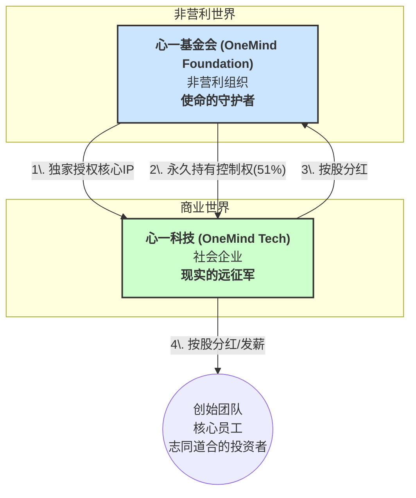

# 《“心一”项目治理架构与顶层设计》

> **版本**: 1.0
> **日期**: 2025-07-31
> **摘要**: 本文档旨在系统性阐述“心一”项目的独特治理架构。该架构的核心目标，是在法律和金融层面，确保项目以“解放心灵”为核心使命，并被永久守护，同时为团队提供公平的激励，为商业化运营提供可持续的动力。

---

## **一、核心原则：使命第一，激励贡献**

“心一”的顶层设计，遵循两大核心原则：

1.  **使命不可动摇**: 公司的控制权必须永远服务于其社会使命，而非服务于任何个人或资本的利润最大化目标。
2.  **贡献必有回报**: 公司的经济收益权，应公平地分配给项目的核心创造者（创始团队、员工）与支持者（志同道合的投资者）。

为实现这一目标，我们设计了一套“双实体混合”架构。

---

## **二、双实体混合架构：理想的守护者与现实的远征军**

我们将项目的“理想”与“现实”在组织层面进行分离，并让后者服务于前者。

*   **心一基金会 (非营利)**:
    *   **角色**: 整个生态的“定海神针”。
    *   **职能**: 持有核心IP（商标、代码所有权），治理开源社区，并永久持有“心一科技”的绝对控制权。

*   **心一科技 (社会企业)**:
    *   **角色**: 项目在市场中创造价值的实体。
    *   **职能**: 负责产品的商业化运营（如B2G教育解决方案），并为所有股东（包括基金会、团队、投资者）创造可持续的经济回报。

## **三、永不稀释的控制权：三道法律防火墙**

为确保基金会的控制权在多轮融资中永不旁落，我们在“心一科技”的《公司章程》中，设置了三道核心的法律防火墙。

### **防火墙一：AB股架构——分离控制权与收益权**

*   **A类股 (使命控制股)**:
    *   **初始占比**: 51%。
    *   **持有者**: 仅限“心一基金会”。
    *   **权利**: 拥有**超级投票权**（确保总投票权始终为51%），并享有**与其持股比例相应的经济分红权**。
*   **B类股 (经济激励股)**:
    *   **初始占比**: 49%。
    *   **持有者**: 创始团队、核心员工与**志同道合的投资者**。
    *   **权利**: 拥有**普通投票权**，并享有**与其持股比例相应的经济分红权**。

### **防火墙二：浮动投票权——锁定51%的绝对控制**

*   **条款核心**: 在《公司章程》中明确规定，无论公司发行多少B类股，所有A类股的总投票权，将**自动调整并永久等于**公司总投票权的**51%**。
*   **效果**: 从数学上杜绝了基金会控制权被稀释的任何可能性。

### **防火墙三：转让锁定——杜绝控制权交易**

*   **条款核心**: 在《公司章程》中明确规定，A类股**永久不可交易**。任何试图转让A类股的行为，都会导致该股份**自动转换为普通的B类股**，其超级投票权永久消失。
*   **效果**: 从法律上确保了超级投票权与基金会的“监护人”身份永久绑定，无法被当成资产出售。

## **四、核心人事架构**

为确保“心一”项目的双实体高效运转，其核心人事架构如下：

*   **心一基金会 (使命的守护者)**
    *   **会长**: **白峰杉教授** 
    *   **核心职责**: 作为基金会的最高精神领袖与最终决策者，把握项目的宏大愿景与核心价值观，并利用其社会公信力与学术网络，为项目链接关键资源。

*   **心一科技 (现实的远征军)**
    *   **创始人**: **黄彩龙**
    *   **核心职责**: 作为社会企业的负责人，全面负责产品的研发、运营、市场推广与商业化，带领团队在现实世界中冲锋陷阵，并为所有股东创造价值。

## **五、结论：一个为理想而生的坚实架构**

通过“基金会+社会企业”的混合模式，以及“AB股+浮动投票权+转让锁定”这三道法律防火墙，我们为“心一”项目构建了一套在法律和金融层面都无懈可击的顶层架构。

这套架构，使得“心一”能够：
*   **名正言顺地**追求其社会使命。
*   **体面公平地**回报其核心团队。
*   **充满信心地**吸引与其志同道合的投资者。