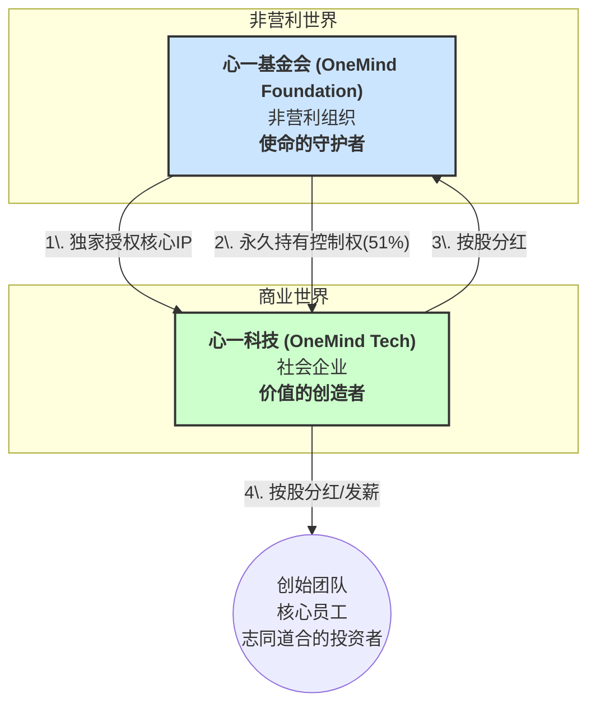

# 《“心一”：治理之道》

> **版本**: 1.0
> **日期**: 2025-07-31
> **摘要**: 本文档旨在系统性阐述“心一”项目的独特治理架构。该架构的核心目标，是在法律和金融层面，确保项目以“破除精神迷障，释放天生创造力”为核心使命，并被永久守护，同时为团队提供公平的激励，为商业化运营提供可持续的动力。

---

## **一、核心原则：以使命为北辰，与贡献者共创共享**

“心一”的顶层设计，遵循两大核心原则：

1.  **以使命为北辰**: 我们的方向，永远朝向“破除精神迷障，释放天生创造力”这颗北辰星。
2.  **与贡献者共创共享**: 我们的力量，源于每一位核心创造者（创始团队、员工）与支持者（志同道合的投资者）。此架构旨在与所有贡献者共同创造价值，并公平地分享成果。

为实现这一目标，我们设计了一套“双实体混合”架构。

---

## **二、守护者与创造者**

我们将项目的“理想”与“现实”在组织层面进行分离，并让后者服务于前者。

*   **心一基金会 (使命的守护者)**:
    *   **角色**: 守护项目“北辰”使命之人。
    *   **职能**: 持有核心IP，守护“破除精神迷障，释放天生创造力”的核心使命，治理开源社区，并永久持有“心一科技”的控制权，确保方向不偏。同时，**建立并运营“创造力认证体系”**维护认证体系的公信力。

*   **心一科技 (价值的创造者)**:
    *   **角色**: 负责为社会创造价值，并与贡献者分享成果之人。
    *   **职能**: 负责产品的商业化运营，为社会创造价值，并为所有贡献者（基金会、团队、投资者）创造可持续的经济回报。

## **三、温暖的盟约：三条核心条款**

为确保基金会的控制权在多轮融资中永不旁落，我们在“心一科技”的《公司章程》中，设置了三道核心的法律防火墙。

### **条款一：责任与分享**

*   **A类股 (使命控制股)**:
    *   **初始占比**: 51%。
    *   **持有者**: 仅限“心一基金会”。
    *   **权利**: 拥有**超级投票权**（确保总投票权始终为51%），并享有**与其持股比例相应的经济分红权**。
*   **B类股 (经济激励股)**:
    *   **初始占比**: 49%。
    *   **持有者**: 创始团队、核心员工与**志同道合的投资者**。
    *   **权利**: 拥有**普通投票权**，并享有**与其持股比例相应的经济分红权**。

### **条款二：北辰永在**

*   **条款核心**: 在《公司章程》中明确规定，无论公司发行多少B类股，所有A类股的总投票权，将**自动调整并永久等于**公司总投票权的**51%**。
*   **效果**: 从数学上杜绝了基金会控制权被稀释的任何可能性。

### **条款三：责任不移**

*   **条款核心**: 在《公司章程》中明确规定，A类股**永久不可交易**。任何试图转让A类股的行为，都会导致该股份**自动转换为普通的B类股**，其超级投票权永久消失。
*   **效果**: 从法律上确保了超级投票权与基金会的“监护人”身份永久绑定，无法被当成资产出售。

## **四、核心人事架构**

为确保“心一”项目的双实体高效运转，其核心人事架构如下：

*   **心一基金会 (使命的守护者)**
    *   **会长**: **白峰杉教授** 
    *   **核心职责**: 作为基金会的最高精神领袖与最终决策者，把握项目的宏大愿景与核心价值观，并利用其社会公信力与学术网络，为项目链接关键资源。

*   **心一科技 (现实的远征军)**
    *   **创始人**: **黄彩龙**
    *   **核心职责**: 作为社会企业的负责人，全面负责产品的研发、运营、市场推广与商业化，带领团队在现实世界中冲锋陷阵，并为所有股东创造价值。

## **五、结语：本末有序，则事业自成**

通过“基金会+社会企业”的混合模式，以及“AB股+浮动投票权+转让锁定”这三道法律防火墙，我们为“心一”项目构建了一套在法律和金融层面都无懈可击的顶层架构。

这套架构，使得“心一”能够：
*   **名正言顺地**追求其社会使命。
*   **体面公平地**回报其核心团队。
*   **充满信心地**吸引与其志同道合的投资者。

  
    
---

## **附录说明1、人才与激励：双实体是吸引顶尖人才的好办法**

我们要解决的问题是：我们如何为这个伟大的使命，吸引并留住最伟大的人才？

单一的基金会无法解决这个问题，因为它存在“薪酬天花板”和“股权激励缺失”两大根本性枷锁。理想主义者可以为理想牺牲，但我们不能要求所有顶尖人才都做出同等牺牲。

**“双实体”架构，正是为解决这一核心矛盾而设计的。**

它通过“心一科技”这家社会企业，为我们提供了吸引顶尖人才的两大核心工具：

1.  **市场化的薪酬体系**: “心一科技”作为一家公司，可以合法、合规地为核心人才提供有市场竞争力的薪水。

2.  **颠覆性的股权激励**: 我们可以从属于团队与投资者的**49%的B类股池子**中，规划出**员工期权池 (ESOP)**。这使得我们能够为关键人才授予公司期权，让他们在为理想奋斗的同时，也能公平地分享项目成功的经济果实。

**结论**:
“双实体”架构，让我们既能用“使命”感召人才的“灵魂”，又能用“股权”激励人才的“俗身”。这使得我们能够真正地吸引到那群我们最需要的、“既有能力、又有理想”的同行者，共同将“心一”的伟大事业推向成功。

---

## **附录说明2、AI认证与开源：构建不可撼动的公信力**

“创造力认证体系”的成功，其基石是**公信力**。为构建不可撼动的公信力，我们设计了一套独特的、基于AI和开源的认证机制。

1.  **AI作为公正的裁判**: 传统的人为认证，易受主观偏见、人情关系乃至利益输送的影响。为从根源上杜绝这些问题，“心一”的认证过程将以**AI为核心裁判**。AI将基于用户长期的、客观的行为数据（如“知行合一”的实践频率、深度、反馈等），依据明确的算法模型进行评估，最大程度地保证认证的公正性与一致性。

2.  **开源作为终极的透明**: 为防止AI裁判本身被操控或滥用，我们将认证体系的**核心算法与代码，面向全社会开源**。这相当于将我们的“评分标准”和“判卷流程”完全置于阳光之下，接受全球所有开发者和专家的监督与审计。

通过“AI裁判”与“开源监督”的双重保障，我们旨在建立一个真正值得信赖的、能够为社会持续输送创造性人才的认证新范式。