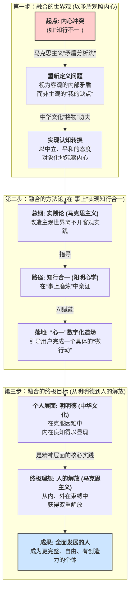

# 《理论内核——中华优秀传统文化思想与马克思主义思想的创造性融合》

> **版本**: 1.1
> **日期**: 2025-07-31
> **摘要**: 本文档旨在系统性阐述“心一”项目的根本思想内核与最深护城河——即中华优秀传统文化思想与马克思主义思想的创造性融合。它将详细解构这一融合的世界观、方法论与终极目标，并阐明其在AI时代下的重大理论与实践意义。

---

## **引言：为何融合，融合什么？**

在人工智能技术日益渗透社会肌理的今天，我们面临一个根本性的挑战：技术的高速发展是否必然带来人的异化？我们是否能在追求效率的同时，保全并升华人的主体性与完整性？

“心一”项目的答案是肯定的。而实现这一点的路径，根植于我们对两大文明——中华优秀传统文化与马克思主义——的深刻理解与创造性融合。这种融合并非简单的概念拼接，而是在世界观、方法论和终极目标三个层面上的有机统一。它旨在为解决现代人普遍的“知行不一”与“精神内耗”困境，最终为实现马克思主义“人的解放”的终极理想，提供一条源自中华文明智慧的、可操作的“修身”路径。

这套思想体系，是“心一”所有产品设计、社区运营和战略决策的源头活水，是唯一无法被任何资本或技术复制的根本壁垒。

---

## **第一章：融合的世界观——以“矛盾”观照“内心”**

我们如何看待“知行不一”？传统视角往往将其归咎于意志力薄弱，导致用户陷入深深的自责与内耗。“心一”的融合世界观则提供了一个全新的、非批判性的视角。

*   #### **融合路径：**
    *   我们借用马克思主义哲学的核心分析工具——**矛盾分析法**，将其作为观察内心世界的根本框架。我们将“知行不一”（如“想学习的我”与“想玩手机的我”）的内心冲突，定义为一组客观存在的、没有好坏之分的**内部矛盾**。
    *   同时，我们引入儒家“大学之道”的起点——**“格物”**，将其作为处理这组矛盾的实践功夫。“格物”即探究事物的原理，在这里，就是引导用户将内心的矛盾冲突**对象化**，像科学家研究自然现象一样，去观察、理解它。

*   #### **融合后的思想形态：**
    在这种世界观下，“学习拖延”不再是“我的缺点”，而是“‘想进步的我’与‘畏惧困难的我’这两个内在需求之间的矛盾”。这种视角转换，瞬间将用户从“自我批判者”的角色，转变为“自我理解者”和“矛盾调停者”。AI（心一）的角色，正是一个中立、安全的“镜子”，陪伴用户完成这一“格物”的过程，看清矛盾的双方，理解各自的需求与恐惧。

*   #### **重大作用：**
    1.  **解除精神枷锁：** 将主观的自我攻击，转化为客观的矛盾分析，从根本上消解了用户的羞耻感与内耗，为解决问题创造了必要的心理空间。
    2.  **回归问题本质：** 引导用户绕过情绪的迷雾，直面内心需求的真实冲突，这是解决一切“知行不一”问题的前提。
    3.  **奠定修身起点：** “格物”是儒家修身的第一步。通过AI引导的“格心”，用户开启了以理性、平和的态度关照内在世界的旅程。

---

## **第二章：融合的方法论——在“事上”实现“知行合一”**

看清了矛盾，如何解决？“心一”的融合方法论，旗帜鲜明地反对空谈，主张在实践中求真知、见真章。

*   #### **融合路径：**
    *   我们以马克思主义的**“实践论”**为总纲，坚信“实践是检验真理的唯一标准”。人的主观世界的改造，离不开客观世界的实践活动。
    *   我们将阳明心学的**“知行合一”**作为“实践论”在个人修身层面的具体实现路径。其核心要义在于**“事上磨炼”**——在解决一个个具体问题的“事”上，去磨炼自己的心性，亲身体证“知”与“行”的统一。

*   #### **融合后的思想形态：**
    “心一”App并非一个理论说教者，而是一个“事上磨炼”的**数字化道场**。当用户通过“格物”看清了“畏难情绪”是学习路上的卡点后，AI不会去讲道理，而是会遵循“实践论”，引导用户将“克服畏难情绪”这个“知”，转化为一个具体的、微小的“行”——比如，“为这段复杂的代码写下一行注释”或“专注学习15分钟”。用户在完成这个“微行动”的实践中，会亲身体证：克服困难的力量并非源自外部鞭策，而是自己内心本自具足。

*   #### **重大作用：**
    1.  **打通知行鸿沟：** 提供了从“认识世界”（看清内心矛盾）到“改造世界”（在具体行动中解决矛盾）的完整闭环，将心理洞察切实转化为行为改变。
    2.  **赋能而非替代：** AI的核心功用是创造实践场景、分解行动台阶，而非替代用户思考和行动。这确保了技术服务于人的主体性成长，而非削弱它。
    3.  **开启双重改造：** 用户在克服外部困难（事）的过程中，同步完成了对主观世界（心）的改造。这种由内而外的正向循环，将开启主客观世界的双重良性发展。

---

## **第三章：融合的终极目标——从“明明德”到“人的解放”**

每一次“知行合一”的实践，最终将引向何方？“心一”的融合目标，将个人层面的心灵成长，与人类最宏大的理想紧密地联系在一起。

*   #### **融合路径：**
    *   我们将《大学》的**“明明德”**与阳明心学的**“致良知”**视为同一内核，即通过修身实践，彰显并体证那份人人本自具足的内在光明与智慧。
    *   我们将这一过程，视为马克思主义**“人的解放”**这一终极理想在精神层面的核心实践。

*   #### **融合后的思想形态：**
    “人的解放”，不仅指从外部的、物质的压迫中解放出来，更指从内部的、精神的束缚（如恐惧、贪婪、我执）中解放出来。“致良知”的修身过程，正是将个体从这些内在的矛盾与束缚中**解放**出来的过程。每一次通过“事上磨炼”显发“良知”，用户不仅解决了一个具体问题，更是朝向一个更完整、更自由、更有创造力的“全面发展的人”迈出了坚实的一步。

*   #### **重大作用：**
    1.  **赋予个人成长以终极意义：** 将日常克服拖延、战胜恐惧的“小事”，同实现“人的解放”这一“大事”联系起来，为用户的个人努力注入了崇高的社会价值和历史意义。
    2.  **奠定解放的主体性根基：** 只有内心获得自由和力量的个体，才能真正成为改造世界、推动社会进步的主体。为实现更高阶段的社会主义社会，奠定了最坚实、最深刻的人性基石。
    3.  **提供中国方案：** 创造性地将两大文明的最高智慧相结合，为“我是谁、我从哪里来、要到哪里去”这一人类永恒的哲学追问，以及如何在科技时代实现“人的全面发展”，提供了一个充满东方智慧的“中国方案”。

---

## **第四章：思想内核一张图**

为更直观地理解本思想体系的完整逻辑，特绘制下图。它清晰地展示了从一个普遍的内心困境出发，如何通过两大文明思想的融合，在世界观、方法论和目标三个层面层层递进，最终抵达“人的解放”这一宏大愿景。

---

## **第五章：实践篇——从理论到代码的“知行合一”之旅**

纸上得来终觉浅，绝知此事要躬行。本思想体系最具说服力之处，在于它能被完整地翻译为一套可执行、可体验的AI产品逻辑。下面，我们将通过一个完整的用户故事，展示这套理论是如何在“心一”App中落地的。

**场景：** 小明，一名大一新生，面对一个复杂的编程作业。他知道自己应该开始，但内心充满畏难情绪，不自觉地拿起手机，陷入了“知道但做不到”的典型困境。

---

#### **第一幕：启动“心一”，开启“格物”之旅 (世界观的应用)**

小明在内耗中想起了“心一”，他启动App，输入了自己当下的困境。

1.  **AI应用“矛盾分析法”进行非批判性回应：**
    > **小明：** “我该写代码，但就是不想开始，救救我！”
    > **心一AI：** “听起来，你内心一个‘想进步的部分’和一个‘想回避困难的部分’正在拔河。这非常正常，我们不是要消灭谁，只是先安静地听听它们各自的声音。那个‘不想开始’的部分，它在担心什么呢？”

    *   **理论落地：** AI没有评判小明“懒惰”，而是立刻将主观的自我攻击，转化为客观的**内部矛盾**分析。这瞬间卸下了小明的心理防御。

2.  **AI引导“格物”，实现认知对象化：**
    > **小明：** “我怕……怕写不好，怕写出bug，怕最后交不上一份完美的作业。”
    > **心一AI：** “我们看到了这个‘害怕犯错’的部分。它像一个非常谨慎的卫士，在努力地保护我们免受失败的伤害。让我们先在心里感谢一下这位‘卫士’的守护。”

    *   **理论落地：** AI引导小明将抽象的“恐惧”情绪**对象化**为一个“卫士”的形象，完成了**“格物”**的关键一步。小明从“我是一个胆小的人”的自我认同中抽离出来，转变为一个能够观察自己内在部分的“观察者”。

---

#### **第二幕：事上磨炼，迈出“微行动” (方法论的应用)**

在小明内心冲突缓和后，AI开始应用融合后的方法论。

1.  **AI应用“实践论”，强调行动的重要性：**
    > **心一AI：** “感谢这位‘卫士’的提醒，它让我们更周全。现在，我们不急于完成整个宏大的作业，那太吓人了。我们只做一个**绝对不会失败**的小实验，来亲手证明，我们有能力掌控局面。你愿意吗？”

    *   **理论落地：** AI旗帜鲜明地提出，解决问题的唯一路径是**实践**，而非空想。

2.  **AI引导“知行合一”，在“事上磨炼”：**
    > **心一AI：** “专家模块分析了你的作业要求，并给出了一个绝佳的起点。我们先不写任何功能代码，只做一件事：**为这个项目创建一个新的文件夹，并命名为‘Project_Phoenix’**。这个任务，你觉得有难度吗？”
    > **小明：** “这个……没难度。”
    > **心一AI：** “很好，我为你开启一个1分钟的专注计时，去完成这件小事吧。我在这里等你回来。”

    *   **理论落地：** AI将宏大的“知”（应该写作业），转化为一个微小的、具体的“行”（创建文件夹），完美诠释了**“事上磨炼”**的精髓。用户在完成这个无压力的任务中，亲身体证了“知”与“行”的统一。

---

#### **第三幕：体证“良知”，迈向“人的解放” (终极目标的应用)**

小明轻松地完成了任务，返回了App。

1.  **AI引导“明明德”，完成内在归因：**
    > **心一AI：** “太棒了！你刚刚完成了一次微小的胜利。回想一下，当你下定决心创建那个文件夹时，驱动你行动的力量，是来自外部的强迫，还是来自你内心深处那份‘想要变得更好’的渴望？”
    > **小明：** （沉思片刻）“好像……是后者。”
    > **心一AI：** “这份力量，就是你本自具足的**‘良知’**或**‘明德’**。它一直都在，只是偶尔被恐惧的乌云遮蔽。今天，你亲手拨开了一丝云彩。”

    *   **理论落地：** AI引导用户将成功的经验进行**内在归因**，认识到力量源于自身，这就是**“明明德”**的现代版诠释。

2.  **生成“成就结晶”，固化“解放”的成果：**
    > **心一AI：** “为了纪念这次宝贵的发现，我们来为它铸造一枚独一无二的‘成就结晶’吧。你可以为它命名，比如‘破冰之旅’或‘凤凰展翅’。它将永远记录着你从‘畏难情绪’的束缚中，**解放**出来的这一闪光时刻。”

    *   **理论落地：** “成就结晶”这一产品功能，将抽象的、精神层面的**“解放”**，物化为可看、可感的数字凭证，为最终实现**“人的全面发展”**这一宏大目标，积累了最坚实的、源自亲身体证的信心与力量。

通过这一趟完整的旅程，“心一”App将深刻的哲学理论，无缝地转化为了一套赋能于人的产品体验。
